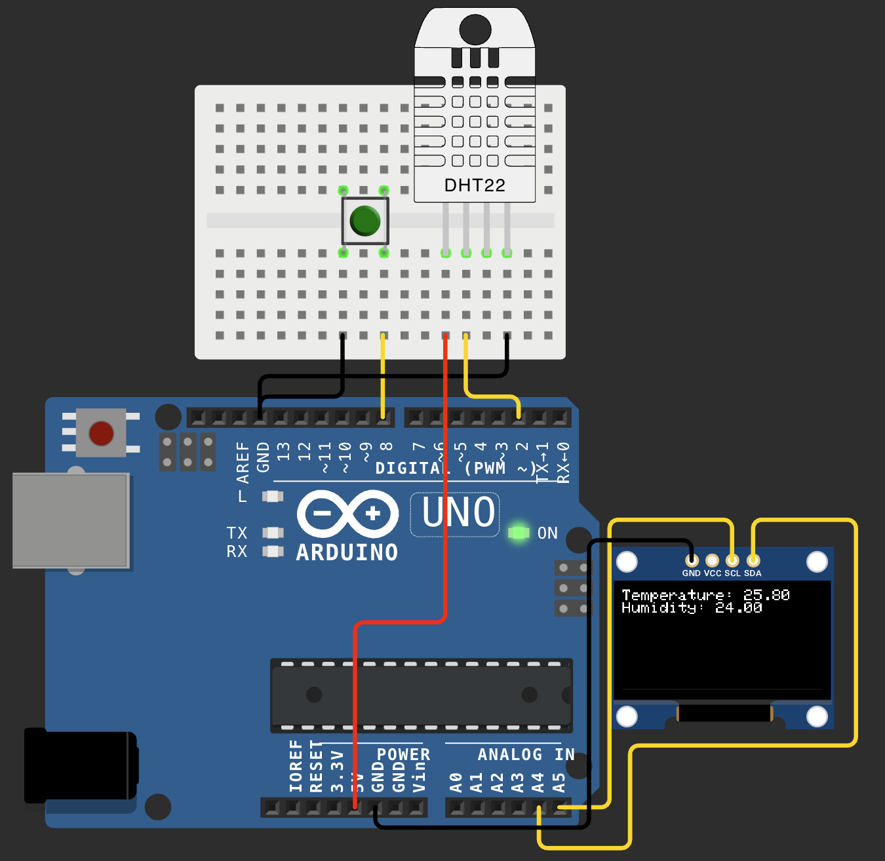

# 🌡️ Arduino Weather Monitor

A simple weather station built with Arduino UNO that reads temperature and humidity from a DHT22 sensor and displays the data on an OLED screen — triggered by a button press.

## ✨ Features

- On-demand temperature & humidity readings (triggered by button)
- Data displayed on a 1.3" OLED screen (128x64)
- Debounce logic for reliable button input

## 🛒 Components

| Component | Description |
|---|---|
| Arduino UNO R3 | Microcontroller |
| DHT22 (AM2302) | Temperature & humidity sensor |
| OLED 1.3" 128x64 I2C | Display |
| Pushbutton (4-pin, 6x6mm) | Trigger for readings |
| Breadboard + jumper wires | Wiring |

## 🔌 Wiring

| Component | Pin | Arduino Pin |
|---|---|---|
| DHT22 | VCC | 5V |
| DHT22 | GND | GND |
| DHT22 | DATA | D2 |
| OLED | VCC | 5V |
| OLED | GND | GND |
| OLED | SCL | A5 |
| OLED | SDA | A4 |
| Button | PIN 1 | D8 |
| Button | PIN 2 | GND |

## 📐 Circuit Diagram

## 📦 Libraries

Install the following libraries via Arduino Library Manager:

- `DHT sensor library` — Adafruit
- `Adafruit Unified Sensor` — Adafruit
- `Adafruit SSD1306` — Adafruit
- `Adafruit GFX Library` — Adafruit

## 🚀 How It Works

1. Press the button
2. Arduino reads temperature and humidity from DHT22
3. Data is displayed on the OLED screen
4. Press again for a fresh reading

## 🔮 Future Ideas

- Auto-refresh every N seconds
- Min/max temperature tracking
- Buzzer alert when temperature exceeds threshold
- Battery-powered portable version

## 🛠️ Simulation

Try it yourself in Wokwi: *[link to your Wokwi project]*

---

*Built as a hobby project to explore Arduino and embedded systems programming.*
